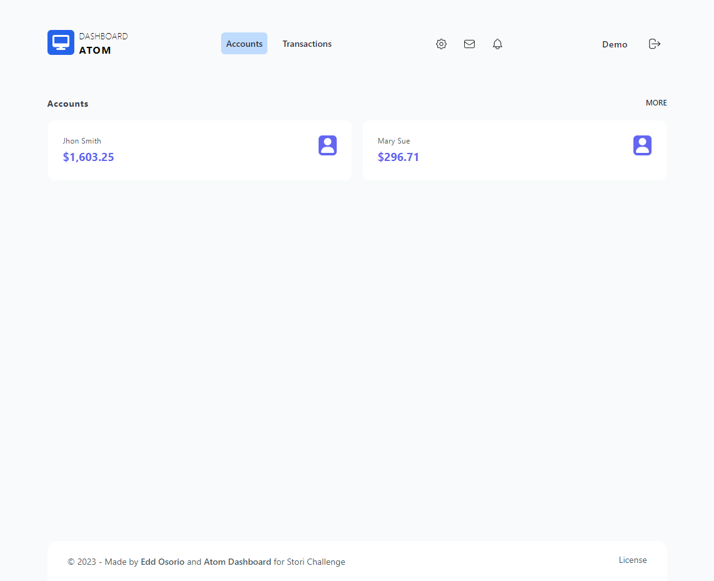
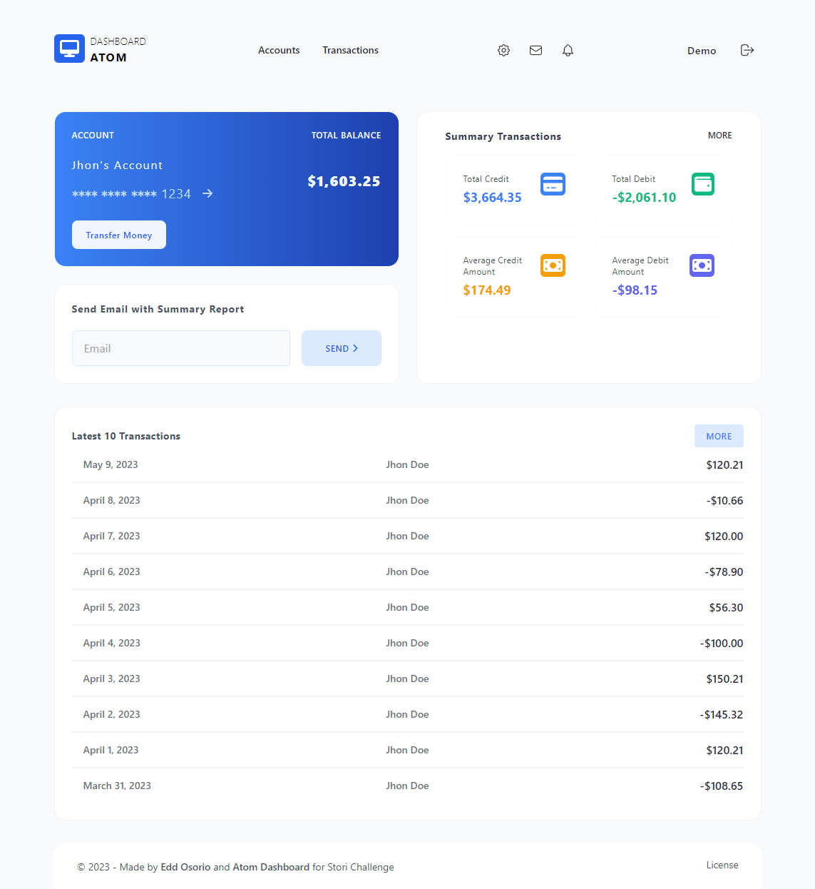

# Transactions History Demo

## Description

This is the Frontend project to show the transactions history of a user. It is a simple project that uses the following technologies:

-   Next.js 13.4.9
-   React 18.0.2
-   Typescript 4.5.5
-   Tailwind CSS 3.0.23
-   Docker
-   Docker Compose
-   Vercel

## Pages available

-   `/`: Home page with the list of User and their Total Balance
     - Clicking on the user name, it will redirect to the Transactions page

-   `/dashboard/user/{id}`: Transactions page with the list of Transactions, the Total Balance and the Summary transactions and the last 10 transactions
     - Clicking on the `Send Email` button, it will sends the summary of all transactions of the user to the given email (this actions was implemented in the backend with AWS Lambda and AWS Simple Email Service and works with a verified email address)

## Architecture

The project uses a simple architecture with the following layers:

-   **Pages**: This layer is in charge of the UI. It is the entry point of the application.
-   **Components**: This layer is in charge of the UI components. It is the core of the application.
-   **Data Sources**: This layer is in charge of the data sources. It is the data access layer of the application (in this case is a REST API hosted in AWS Lambda).

## How to run in local environment

1. Clone the repository [transaction-history-demo](https://github.com/dobleub/transaction-history-demo/tree/main)
2. Inside `transaction-history-demo` folder, add a `.env` file with the following content:

```bash
NEXT_PUBLIC_STORI_TRANSACTIONS_API=http://localhost:3003
```

3. Once `.env` is completed, run the following command in order to create a Docker network and start the server:

```bash
docker network create stori-transactions-history-network
```

4. Once the network is created, run the following command in order to start the server:

```bash
docker-compose up -d --build
```

-   Container name es `transactions-history-demo` and exposes the following ports:
    -   0.0.0.0:3000 -> 3000/tcp

5. The server will be running in your host on port 3000. You can view it in your browser with the following URL:

```bash
http://localhost:3000
```

6. To stop the server, run the following command:

```bash
docker stop transactions-history-demo
```

7. To remove the container, run the following command:

```bash
docker rm transactions-history-demo
```

8. To remove the network, run the following command:

```bash
docker network rm stori-transactions-history-network
```

## How to deploy in Vercel

1. Follow previous steps to run the project in local environment
2. Make some changes
3. Push the changes to the repository at `develop` branch
4. Vercel will deploy the changes automatically
5. You can view the changes in the following URL:

```bash
https://transaction-history-demo.vercel.app/
```

## How to tests

-   No tests were implemented in this project due to lack of time
